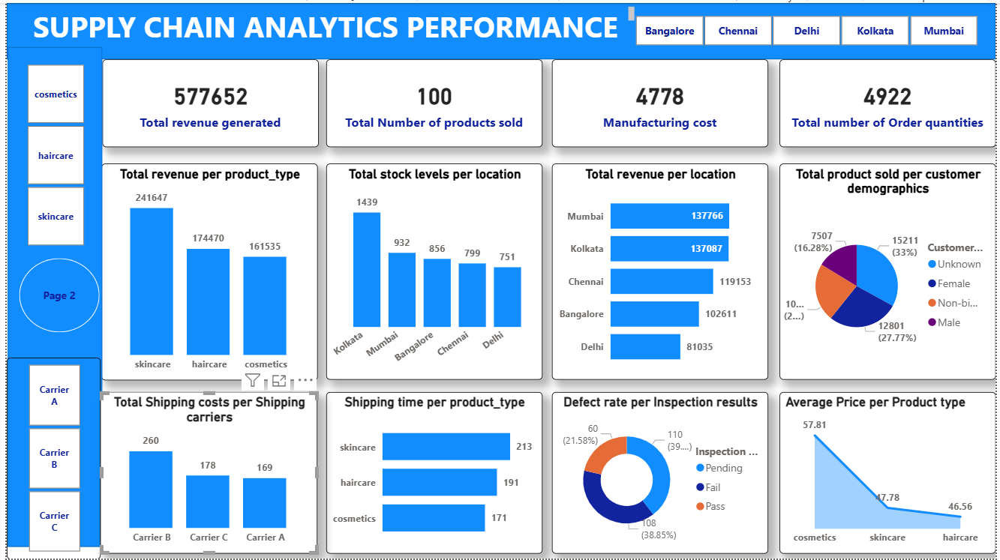

# Fashion-Industry-Supply-Chain
The fashion industry operates on rapid timelines where profitability relies on supplier reliability, tight lead times, and tightly managed shipping costs. This project analyzes fashion supply chain data—encompassing supplier performance metrics, production lead times, defect rates, shipping fees, and product availability.
# Project Executive Summary
This project delivers a comprehensive, data-driven optimization solution for managing retail product supply chains. Utilizing a technical pipeline consisting of SQL for database querying, Power Query for advanced ETL processing, and Power BI for visual storytelling, this interactive intelligence system transforms raw data into actionable tactical insights.

# The dashboard is structured into two main analytical focus areas:

## Supply Chain Analytics Performance:

Focuses on core commercial KPIs, sales velocity, geographical distribution, and revenue generation.

## Supplier Performance Analysis:

Deep dives into back-end operational logistics, carrier transit times, transportation modes, costs, and quality control.

# Technical Methodology & Data Pipeline
## Database Ingestion & SQL Querying
Before building visuals, structured query workflows were applied to aggregate and filter the relational supply chain dataset. SQL operations were executed to:

Validate transaction counts across columns and handle missing data records.

Group revenue-generating fields by location and customer segments to verify consistency.

Extract operational data fields like defect rates, transit lead times, and manufacturing expenses for supplier profiling.

## ETL & Data Cleaning via Power Query
Upon importing data into Power BI, Power Query was utilized to refine the dataset into a clean star-schema-ready structure:

Data Type Enforcement: Handled trailing decimal point values on financial numbers (e.g., Rounding values for Revenue Generated and Manufacturing Costs to clear integer levels for dashboard scannability).

Text Standardization: Applied transformations to ensure uniform grouping across categorical variables like Product Type, Location, and Customer Demographics.

Column Profiling: Checked distribution and error rates to guarantee zero null rows or mismatched entries prior to canvas rendering.

## Dashboard Design & Visualization in Power BI
The data modeling phase used tailored DAX measures to calculate critical KPIs. The frontend visual style features custom-designed rectangular container tiles, sharp typographic hierarchy, and a clean blue-and-white workspace theme. Key UI components include horizontal top-bar filter buttons for dynamic location slicing (Bangalore, Chennai, Delhi, Kolkata, Mumbai) and shipping modes (Air, Rail, Road, Sea).

### Deep-Dive Dashboard Analysis.
Page 1: Supply Chain Analytics Performance
This view provides a macro commercial assessment of sales performance, product pricing structures, and regional sales contributions.

Macro Key Performance Indicators (KPIs):

Total Revenue Generated: $577,652, serving as the baseline commercial anchor.

Total Number of Products Sold: 100 separate product categories/batches.

Manufacturing Cost: Total cost standing at $4,778.

Total Number of Order Quantities: 4,922 units pushed through fulfillment pipelines.

Core Visualization Insights:

Revenue by Product Type: Skincare dominates the financial profile with $241,647, followed sequentially by Haircare ($174,470) and Cosmetics ($161,535).

Stock Distribution vs. Regional Revenue: Kolkata holds the highest inventory volume (1,439 units), yet Mumbai leads in direct financial contribution ($137,766), indicating higher inventory turnover velocity in Mumbai compared to slower moving stock in Kolkata.

Demographic Market Segmentation: A pie chart indicates that the "Unknown" customer group accounts for 31% (15,211) of purchases, while the explicitly identified "Female" demographic drives 25% (12,801).

Quality Risk & Pricing Models: The inspection donut chart reveals that 38.89% (108 cases) of batches are marked as Pass, while 21.58% (60 cases) have Pending statuses. Concurrently, the Average Price line chart indicates that Cosmetics hold the highest premium cost point at $57.81, contrasting with Haircare at $46.56.

Page 2: Supplier Performance Analysis
This page evaluates supply chain back-end operational workflows, exposing logistics constraints, carrier speeds, and manufacturing bottlenecks.

Fulfillment Logistics & Operations:

Transit Times by Transport Route: The column chart clearly identifies a significant lag in rail shipping, with Rail taking an average of 184 days (or total accumulated time), notably slower than Road (137 days), Air (133 days), and Sea (121 days).

Revenue Distribution per Supplier: Supplier 1 stands out as the primary commercial backbone, driving $157,542 in volume. Supplier 4 represents the lowest tier at $86,478.

Transportation Mode Share & Financial Impact: Road freight handles the maximum physical availability load (1.6K), yet the donut chart shows Road transport commands the highest budget allocation share at 28.08% ($15,182).

Supplier Lead Times & Transit Speeds: The treemap graphic illustrates that Supplier 1 (453 days total accumulated lead time) and Supplier 2 (357 days) require the longest operational windows. Conversely, the line chart demonstrates that Air shipping incurs the longest average lead time profile (18.27 days), while Sea routes are optimized down to an average of 12.18 days.

4. Operational Recommendations & Next Steps
Based on the explicit data correlations revealed above, the following operational strategies are recommended:

Reallocate Inventory from Kolkata to Mumbai:
Kolkata holds your highest stock level (1,439 units) but lags in revenue. Mumbai produces the highest revenue ($137,766) on a smaller stock footprint. Moving excess warehouse inventory to Mumbai will maximize stock turnover and reduce localized holding costs.

Optimize Logistics Transit Modes:
Rail cargo experiences severe delays (184 days/units) compared to other modes. Shift critical cosmetic and skincare batches to Sea or Air channels. While Air cargo takes slightly more lead time on average (18.27 days), Sea transit delivers the most optimal combination of rapid transit and lower cost variables.

Audit High-Lead-Time Suppliers:
Supplier 1 generates your highest revenue ($157,542) but suffers from extended lead times (453 days). Introduce more stringent Service Level Agreements (SLAs) or diversify order quantities toward Supplier 2 and Supplier 3 to mitigate supply disruptions during peak consumer demand cycles.
This project delivers a comprehensive, data-driven optimization solution for managing retail product supply chains. Utilizing a technical pipeline consisting of SQL for database querying, Power Query for advanced ETL processing, and Power BI for visual storytelling, this interactive intelligence system transforms raw data into actionable tactical insights.

